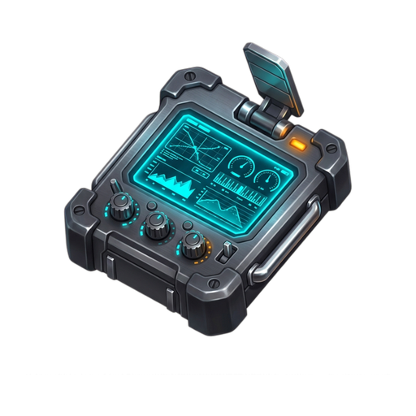

<div align="center">


# AC-Tracker

**The Cyber Flight Operations Deck & Progression Monitor for Airport City**

[](https://react.dev/)
[](https://www.typescriptlang.org/)
[](https://vitejs.dev/)
[](https://tailwindcss.com/)
[](package.json)
[](#offline-storage--privacy)

[Overview](#overview) • [Key Features](#key-features) • [Flight Deck Modules](#flight-deck-modules) • [Map Timer System](#map-timer-system) • [Getting Started](#getting-started) • [Shortcuts & Ergonomics](#shortcuts--ergonomics) • [Community Resources](#community-resources)

</div>

---

## Overview

**AC-Tracker (ACT)** is a flight operations companion created for pilots playing [Airport City](https://www.airportcitygame.com/). Tracking hundreds of destination quotas, star tiers, map expirations, and aircraft assignments across spreadsheets is slow and cumbersome. AC-Tracker replaces manual note-taking with a fast, responsive, cyberpunk-inspired flight deck.

Every destination, map requirement, and flight milestone in Airport City is cataloged and updated with real-time counters, smart filtering, and zero-latency local storage.

> [!NOTE]
> AC-Tracker runs entirely client-side in your web browser. No accounts, backend databases, or external network requests are required. All flight logs and settings remain strictly in your browser's `localStorage`.

---

## Key Features

- **535 Cataloged Flight Routes**: Comprehensive coverage across Standard, Adventure, Space, Alliance, and Seasonal Event destinations with exact star requirements (1★ to 5★).
- **Authentic In-Game Flight Counters**: Dual-input tracking matching the Airport City HUD — log progress directly on your active star tier (`XX / [Target]`) alongside cumulative lifetime flights.
- **Accurate Map Duration Timers**: 100% coverage across all 150 map destinations. Models authentic Airport City timed-flight windows (3h, 6h, 12h 30m, 17h, and single-use) instead of outdated 1-map-per-flight consumption.
- **Flight Progress HUD**: Descending progression board mirroring the in-game star status screen (Ace 5★ down to Specialist 1★), complete with cumulative milestone vs. exact tier mode toggle.
- **Priority Radar & Smart Sorting**: Filter routes by "To Next Star" to instantly find the destinations closest to earning your next star and airport cash.
- **Fleet Hangar Management**: Track owned aircraft, register custom callsigns, and calculate speed, profit, and item drop modifiers.
- **23 Bespoke Themes**: Switch between 13 cyber avionics dark decks and 10 Theme Factory daylight palettes with instant preview swatches.
- **Offline Data Sovereignty**: Full JSON backup and restore capabilities to transfer flight records between devices with one click.

---

## Flight Deck Modules

| Module | Icon | Description |
| :--- | :---: | :--- |
| **Flights Table & Radar** |  | Dense table and card views for managing all 535 destinations. Includes instant search, aircraft filters, collection grouping, and priority sorting. |
| **Map Inventory** |  | Inventory tracking for Adventure, Space, and Alliance map sets. Monitor collected stock, view active flight windows, and spot missing collection maps. |
| **Fleet Hangar** |  | Fleet management suite for ownable planes (Swift through Goldfinch). Configure nicknames, flight stats, and upgrade perks. |
| **Flight Progress & Stats** |  | Flight volume analytics, star completion ratios, aircraft tier distribution charts, and in-game rank breakdown. |
| **Help & Pilot Resources** |  | Quick access to community wikis, official game forums, weekly gift code feeds, interactive world maps, and developer support. |

---

## Map Timer System

In Airport City, activating an expedition or space map does not consume one map per flight. Instead, it activates a **timed flight window** allowing unlimited dispatches to that destination until the countdown expires.

AC-Tracker models these authentic flight timers directly in the flight deck and map inventory:

```
┌────────────────────────────────────────────────────────────────────────┐
│                        MAP DURATION TAXONOMY                           │
├──────────────────────┬─────────────┬───────────────────────────────────┤
│ Category             │ Window      │ Destination Examples              │
├──────────────────────┼─────────────┼───────────────────────────────────┤
│ Alliance Maps        │ 3 Hours     │ All 50 Alliance routes            │
│ Adventure Maps       │ 6 Hours     │ All 80 Excavation routes          │
│ Space (Green)        │ 3 Hours     │ Novosibirsk, Bangalore, Perth     │
│ Space (Blue)         │ 12h 30m     │ Sacramento, Alexandria, Miami     │
│ Space (Red)          │ 17 Hours    │ Vienna, Glasgow, Beverly Hills    │
│ Seasonal Event Maps  │ 2h – 6h     │ Fatima (2h), Area 51 (6h)         │
│ Single-Flight Maps   │ 1-Flight    │ Rovaniemi                         │
└──────────────────────┴─────────────┴───────────────────────────────────┘
```

> [!TIP]
> Coordinate your map activations with fleet availability and flight speedups to maximize the total number of flights completed within a single window.

---

## Getting Started

### Prerequisites

- [Node.js](https://nodejs.org/) (version 18 or higher)
- [npm](https://www.npmjs.com/) (version 9 or higher)

### Installation

1. Clone the repository:
   ```bash
   git clone https://github.com/hbojer-cmyk/AC-Tracker.git
   cd AC-Tracker
   ```

2. Install dependencies:
   ```bash
   npm install
   ```

3. Start the development server:
   ```bash
   npm run dev
   ```

4. Open `http://localhost:3000` in your web browser.

### Production Build

To create a production-ready bundle optimized for GitHub Pages or static web hosting:

```bash
npm run build
```

The output files are generated in the `dist/` directory with static assets automatically copied.

---

## Shortcuts & Ergonomics

| Action | Control / Shortcut | Description |
| :--- | :--- | :--- |
| **Quick Number Edit** | Single Click | Clicking any flight count or map number highlights the entire field for immediate typing without backspacing. |
| **Increment / Decrement** | <kbd>▲</kbd> / <kbd>▼</kbd> Arrow Keys | Press Up or Down while focused on any input field to step the count by 1. |
| **Sort by Next Milestone** | Column Header / Dropdown | Sort by **To Next Star** to push flights nearest completion to the top of your deck. |
| **Theme Selector** | Top Bar Palette Icon | Switch between 23 avionics dark palettes and daylight high-visibility themes. |
| **Data Backup** | Top Bar "Data" Button | Export your entire flight database as a `.json` backup file or restore from a previous save. |

---

## Offline Storage & Privacy

AC-Tracker is designed with zero server dependency:

- **Local Persistence**: All flight tallies, map counts, fleet records, and UI preferences are written to browser `localStorage`.
- **Zero Telemetry**: No third-party analytics trackers, cookies, or remote data sync.
- **Portability**: Create regular JSON backups via the header data modal to sync progress between your desktop cockpit and mobile device.

> [!IMPORTANT]
> Clearing browser cache or website data will remove locally stored flight counts. Always export a JSON backup before performing browser maintenance.

---

## Community Resources

- [Airport City Wiki](https://www.airportcitygame.com/wiki/) — Comprehensive game database, quest guides, and building specs.
- [Airport City Game Forums](https://www.airportcitygame.com/) — Community trading, neighbor friend codes, launch groups, and alliance strategies.
- [Airport City Official Facebook](https://www.facebook.com/AirportCity) — Weekly promo codes, bonus fuel gifts, and developer announcements.
- [Game Insight Support Desk](https://gameinsight.helpshift.com/hc/en/16-airport-city/) — Account restoration, bug reports, and official FAQs.
- [World Destinations Interactive Map](https://www.google.com/maps/d/u/0/viewer?hl=en&mid=1MY3JDc6Lr2XaTiP9RC7GzVcJDuOhyvQv) — Global geographic map of all Airport City flight destinations.
